# Canny 边缘检测
17364025 贺恩泽
## 封装代码 1
Code_1 的代码采用了 OpenCV 作为图像处理库，在封装时需要将其更换为仅使用 CImg 库做图像处理。

相对于 OpenCV 的 `Mat`，CImg 采用 `CImg<T>` 这更为底层的直接封装方式封装了一个图片。由于 CImg 不包含各种常用图像处理算法，因此手动编写算法直接处理原始图像的像素数据。

Canny 边缘检测主要步骤如下：

1. 彩色转灰度
2. Gaussian 滤波
3. Sobel 滤波
4. 非最大值抑制
5. 双阈值

上述 5 个步骤完成后，最终的输出即为检测到的图像边缘。而 Canny 算子包含有三个主要的参数：卷积核大小、低阈值和高阈值，卷积核大小用在滤波操作上，而两个阈值用在双阈值操作上。

因此，将程序整体封装为如下：

```cpp
class Canny {
private:
    // 创建 Gaussian 滤波器
    vector<vector<double>> create_filter(int row, int column, double sigmaIn);
    // 将图片转为灰度图
    CImg<byte> luminance(CImg<byte> imgIn);
    // Gaussian 滤波
    CImg<byte> gaussian(CImg<byte> imgIn, vector<vector<double>> filter);
    // Sobel 滤波
    CImg<byte> sobel();
    // 非最大值抑制
    CImg<byte> non_max_suppression();
    // 双阈值
    template<typename T>
    CImg<T> threshold(CImg<T> imgIn, int low, int high);
public:
    void detect(const char* filename, int core_size, int threshold_low, int threshold_high);
};
```

向外部仅暴露 `detect` 函数作为运行 `Canny` 检测算法的入口。

然后，将对 `Mat` 的操作重写为对 `CImg<T>` 的操作即可。

OpenCV 使用 `CV_8UC1` 表示 8 位 1 通道图像，对应 CImg 的类型为 `CImg<unsigned char>`，并且构造时向参数 `c` 传入 1。

而 `CV_32FC1` 则表示 32 位浮点 1 通道，对应 `CImg<float>`，并且构造时向参数 `c` 传入 1。

封装完成后，只需要调用 `canny` 函数即可进行边缘检测。

## 删除短边缘
对于边缘长度小于 20 的边缘，新增一个函数将其删除：

```cpp
CImg<byte> link_contours(CImg<byte> imgIn);
void remove_contours(CImg<byte> &imgIn, CImg<bool>& map, int x, int y, int step, bool &clean);
```

调用 `link_contours` 函数即可对图像进行该处理。`remove_contours` 是一个辅助函数，用于搜索相邻的边缘并删除小于 20 的边缘，也是实现该删除算法的核心。

```cpp
CImg<byte> Canny::link_contours(CImg<byte> imgIn) {
    // 记录是否已访问
    CImg<bool> map = CImg<bool>(imgIn.width(), imgIn.height());

    for (int i = 0; i < map.width(); i++) {
        for (int j = 0; j < map.height(); j++) {
            *map.data(i, j) = 0;
        }
    }

    for (int i = 0; i < imgIn.width(); i++) {
        for (int j = 0; j < imgIn.height(); j++) {
            // 如果未访问过且含有边缘信息
            if (!(*map.data(i, j))) {
                if (*imgIn.data(i, j) > 0) {
                    bool clean = false;
                    remove_contours(imgIn, map, i, j, 1, clean);
                }
            }
        }
    }
    return imgIn;
}
```

该算法用一个 `map` 表示是否已经访问过，然后遍历图像的每一个未访问的、包含边缘信息的像素，以该像素为起点在周围查找所有相邻的边缘。

查找边缘采用递归算法，根据 8 个方向向量进行搜索：
```cpp
void Canny::remove_contours(CImg<byte>& imgIn, CImg<bool>& map, int x, int y, int step, bool& clean) {
    // 方向向量
    const int dx[] = { 1,-1,0,0,1,1,-1,-1 };
    const int dy[] = { 0,0,1,-1,1,-1,1,-1 };
    bool found = false;
    for (int i = 0; i < 8; i++) {
        // 判断是否在区域内、是否访问过以及是否有值
        if (x + dx[i] >= 0 &&
            y + dy[i] >= 0 &&
            x + dx[i] < map.width() &&
            y + dy[i] < map.height() &&
            !(*map.data(x + dx[i], y + dy[i])) &&
            *imgIn.data(x + dx[i], y + dy[i]) > 0) {
            *map.data(x + dx[i], y + dy[i]) = true;
            found = true;
            clean = false;
            // 递归查找
            remove_contours(imgIn, map, x + dx[i], y + dy[i], step + 1, clean);
        }
    }

    // 未找到新的相邻边缘且已有边缘长度小于 20
    if (!found && step < 20) {
        clean = true;
    }
    // 回溯时清理边缘
    if (clean) {
        *imgIn.data(x, y) = 0;
    }
}
```

如果在某一步发现已经找不到任何的相邻点了，则说明搜索完毕，此时如果发现已找到的边缘长度小于 20，则更新 `clean`，并清理当前点，算法回溯时同样检测 `clean`，如果在未来被标记为 `true`，则说明当前点所在的位置处于一个小于 20 长度的边缘中，因此也一并清理。

最后留下来的只有不小于 20 长度的边缘信息。

## 测试
### 改变阈值
首先对不同的双阈值参数进行测试。

分别指定 20~40，20~100，50~150 三种阈值查看结果：

3.bmp：
- 原图

  
- 20~40

  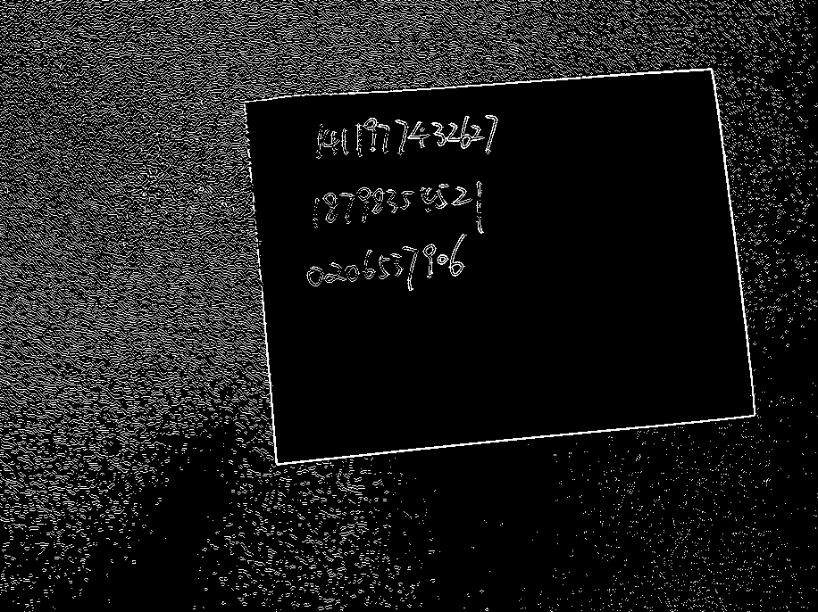
- 20~100

  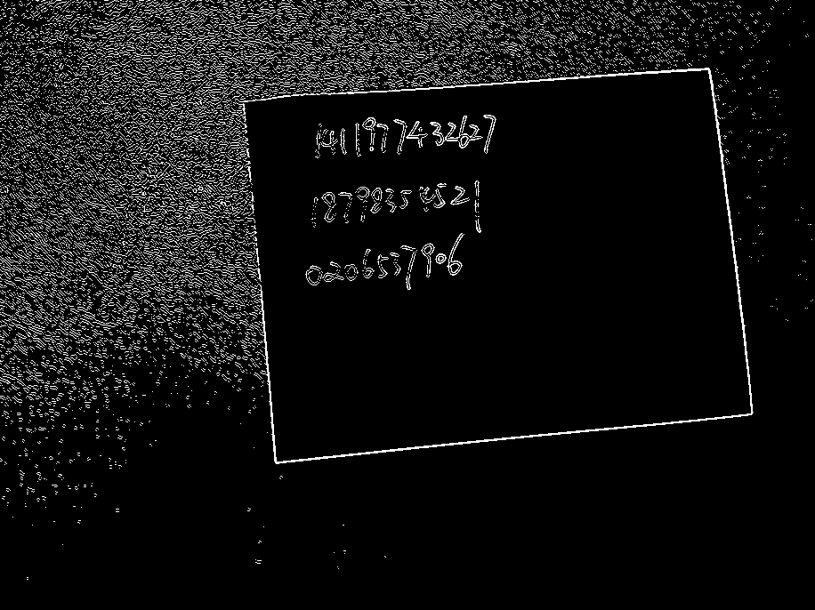
- 50~150

  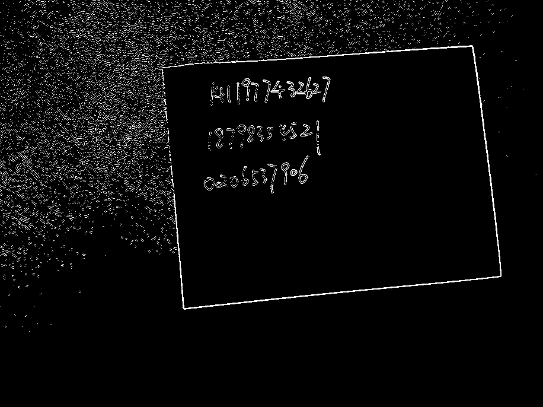

4.bmp：
- 原图

  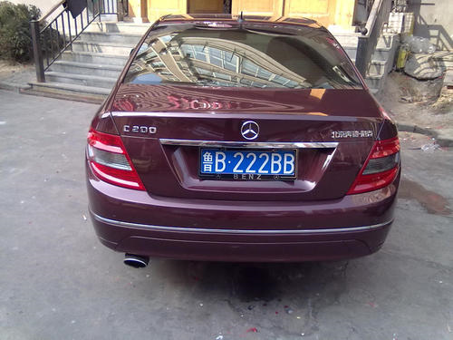
- 20~40

  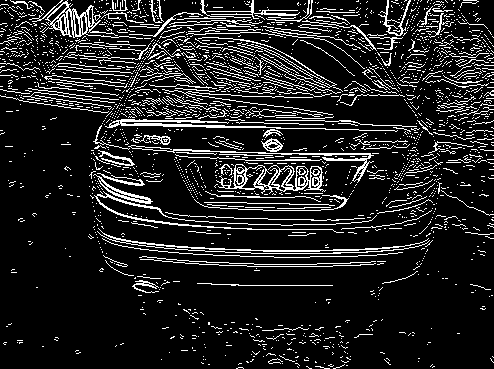
- 20~100

  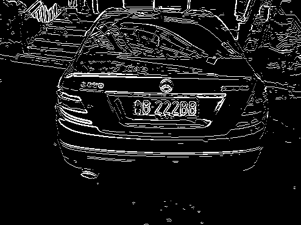
- 50~150

  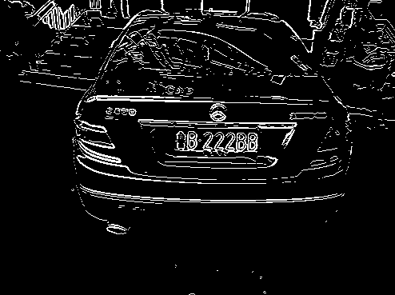

20160326110137505.bmp：
- 原图

  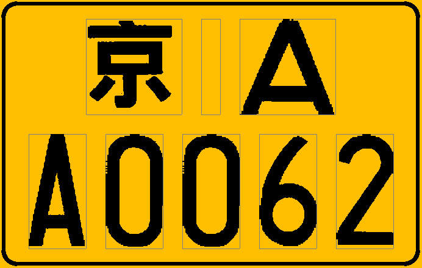
- 20~40

  
- 20~100

  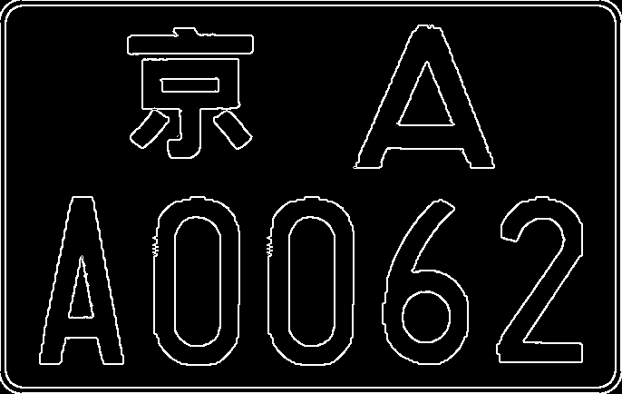
- 50~150

  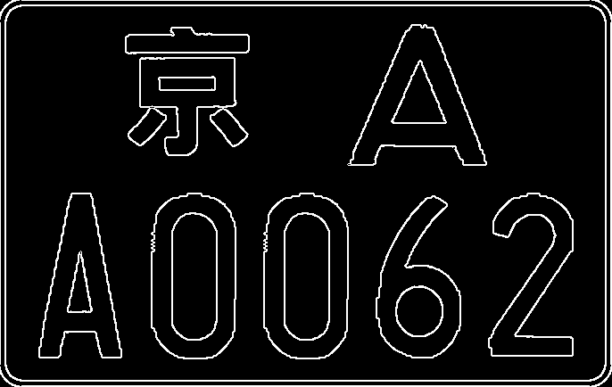

bigben.bmp：
- 原图

  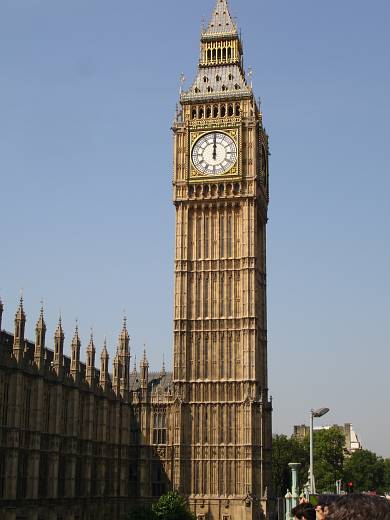
- 20~40

  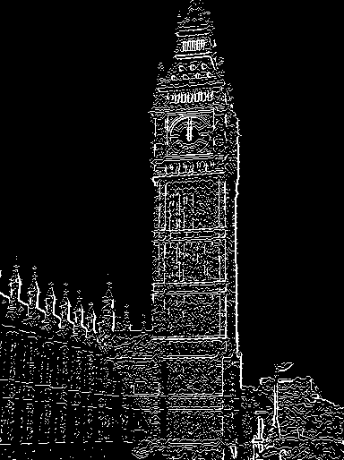
- 20~100

  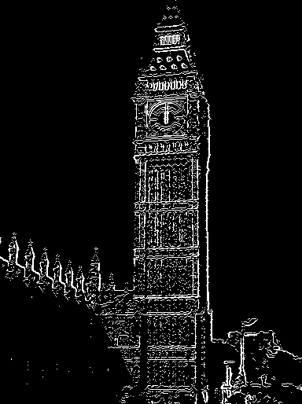
- 50~150

  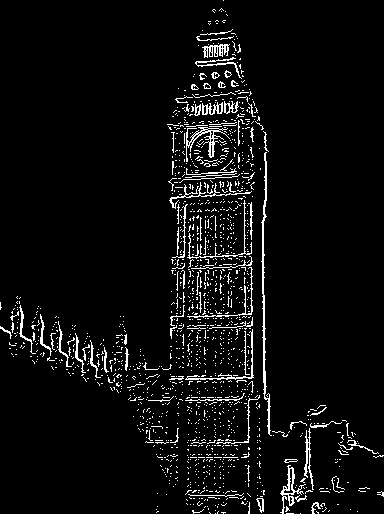

lena.bmp：
- 原图

  
- 20~40

  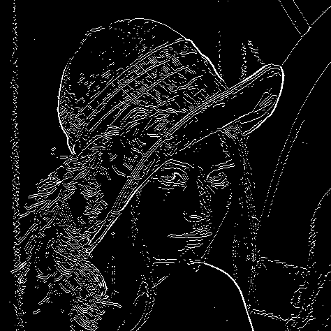
- 20~100

  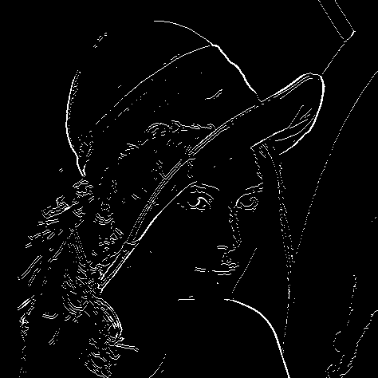
- 50~150

  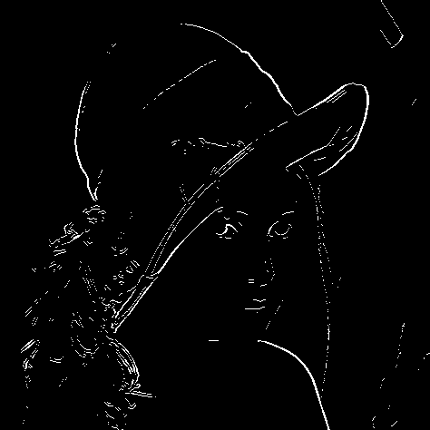

stpietro.bmp：
- 原图

  
- 20~40

  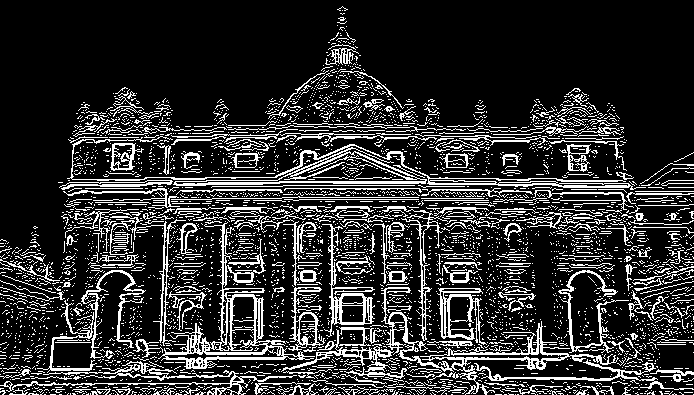
- 20~100

  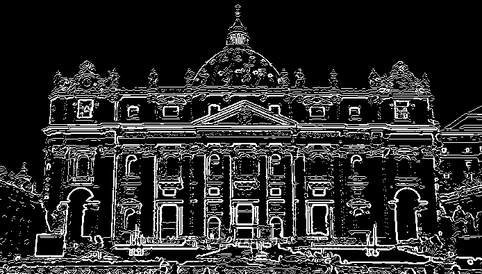
- 50~150

  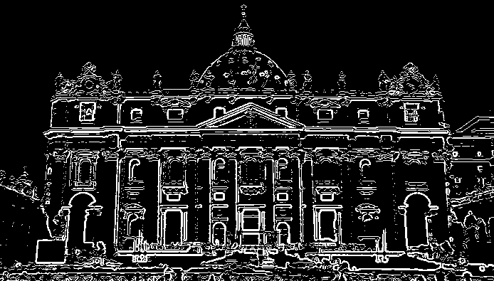

可以看到，在高阈值提高的过程中，检测出来的“杂点”数量减少，这些“杂点”对应原图中暗色但非全黑的部分，因为阈值较低而未被排除在检测结果之外。

如果进一步同时提高低阈值和高阈值的话，则“杂点”进一步减少，因为对暗色暗度的容忍度降低了，但是这样做使得 `4.bmp` 和 `lena.bmp` 丢失了更多的细节。

### 改变卷积核大小
改变卷积核的大小观察不同参数的输出，固定阈值为 20 和 100。

3.bmp：
- 原图

  
- 3

  
- 5

  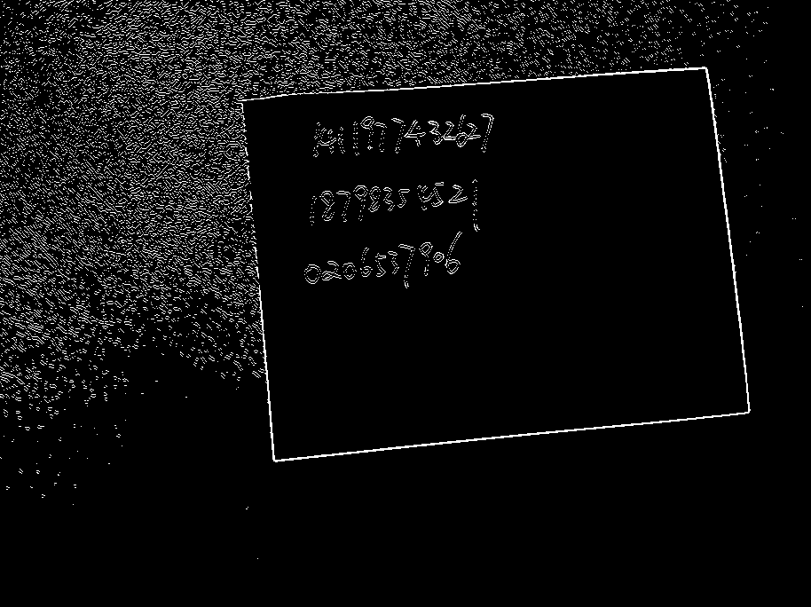
- 7

  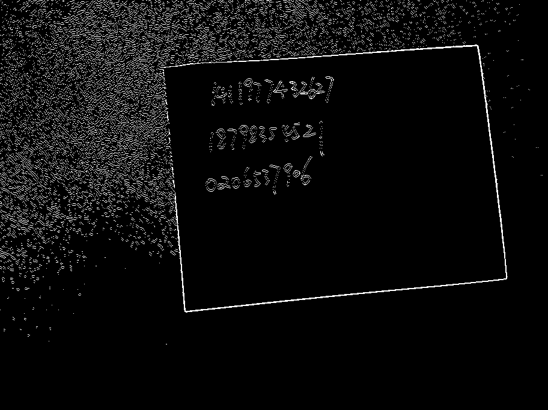

4.bmp：
- 原图

  
- 3

  
- 5

  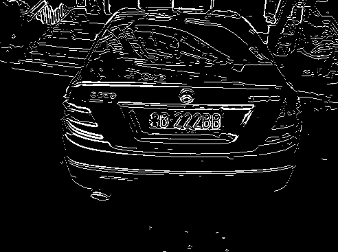
- 7

  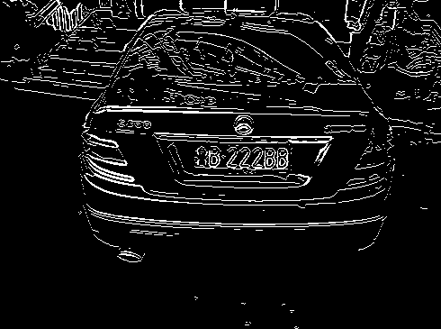

20160326110137505.bmp：
- 原图

  
- 3

  
- 5

  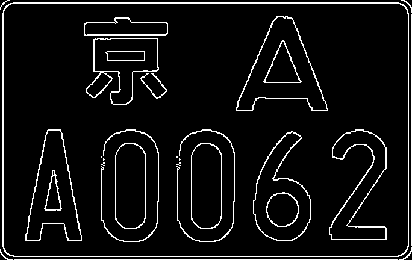
- 7

  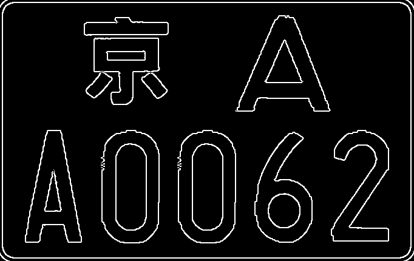

bigben.bmp：
- 原图

  
- 3

  
- 5

  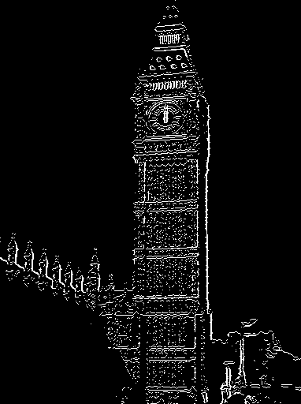
- 7

  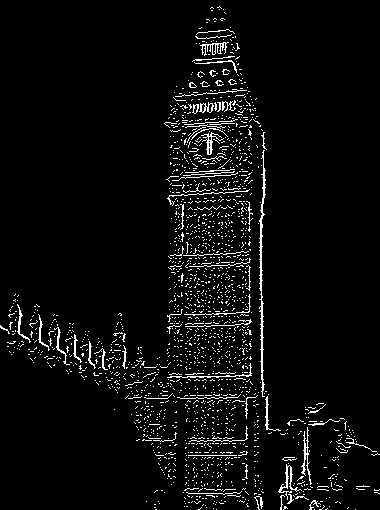

lena.bmp：
- 原图

  
- 3

  
- 5

  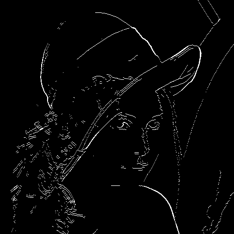
- 7

  

stpietro.bmp：
- 原图

  
- 3

  
- 5

  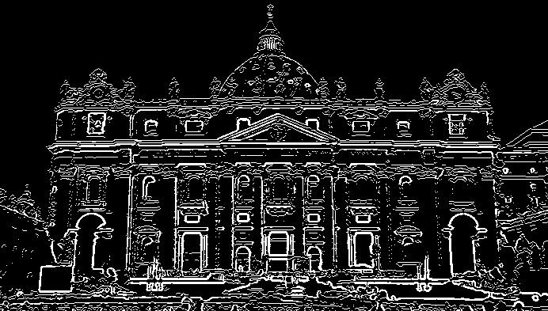
- 7

  

可以看到不同的卷积核大小，得到的结果不太相同。当卷积核增大时，滤波步骤结束后的图像更加“模糊”，相当于对图像进行了羽化，这样检测结果就不易受到图像中的噪点影响，这一点在 `stpietro.bmp` 上体现的较为明显。

但是如果过大则会导致图像丢失细节，对应的，使得检测出来的结果也变少，例如 `lena.bmp`，当卷积核大小增加到 7 时，头发处的边缘信息丢失较为严重。

### 删除短长度边缘
接下来对比是否删除长度小于 20 的边缘的检测结果，下列结果代入卷积核大小 3 以及阈值 20 和 100 后得出。

3.bmp：
- 原图

  
- 不删除短边缘

  
- 删除短边缘

  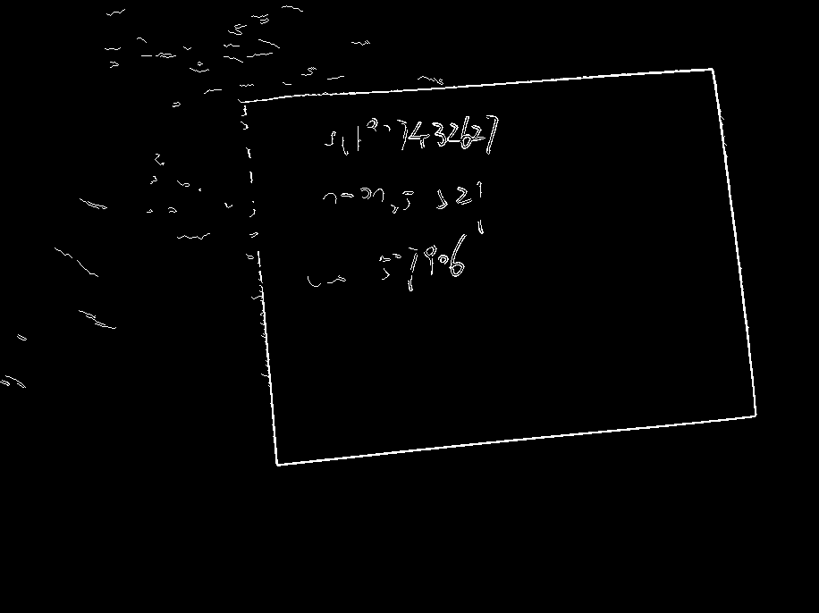

4.bmp：
- 原图

  
- 不删除短边缘

  
- 删除短边缘

  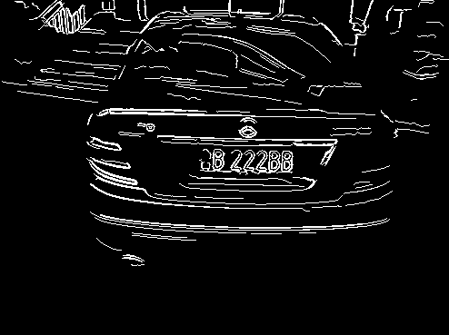

20160326110137505.bmp：
- 原图

  
- 不删除短边缘

  
- 删除短边缘

  

bigben.bmp：
- 原图

  
- 不删除短边缘

  
- 删除短边缘

  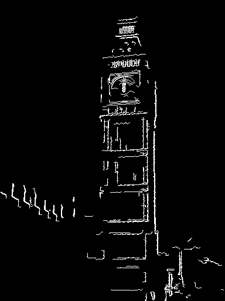

lena.bmp：
- 原图

  
- 不删除短边缘

  
- 删除短边缘

  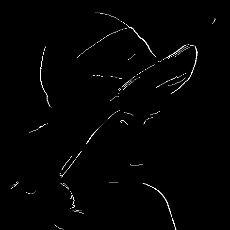

stpietro.bmp：
- 原图

  
- 不删除短边缘

  
- 删除短边缘

  

由以上结果可以看出，当删除了短边缘后，`false positive` 大幅度减少，因为这类 `false positive` 是由于原图像中随机位置处的噪声导致的，删除这些短边缘后，得到的边缘更加干净和清晰，对于 `stpietro.bmp` 和 `4.bmp` 这种作用极为明显，使得识别出来的边缘变得更加准确和清晰。

但是删除这些短边缘却会导致 `false negative` 增加，由于图像中一些有效边缘的长度可能本身就小于 20，这么做显然将本来应该检测出来的边缘从结果中剔除了出去，对于 `3.bmp` 和 `lena.bmp` 这种副作用极为明显，导致识别出来的边缘存在大范围的缺失。

## 总结
Canny 算法是一种常用的边缘检测算法，整体算法流程为：彩色转灰度、Gaussian 滤波、Sobel 滤波、非最大值抑制和双阈值。根据提供的卷积核大小以及双阈值的变化，检测效果有所不同。

当阈值整体提高时，对于暗色的区域敏感度降低；而当阈值整体降低时，对于暗色的区域敏感度提高。

提高阈值可以带来更少的 `false positive`，但是可能会引入更多的 `false negative`。

增加卷积核大小能够一定程度上减少图像噪点带来的影响。但是随着大小增大，图像的细节也在不断地缺失，使得 `false negative` 不断增多。

删除短边缘可以有效地清理识别结果中的 `false positive`，但是这样的算法并不能对图像中本来存在的短边缘进行感知，因此可能会导致更高的 `false negative`。
