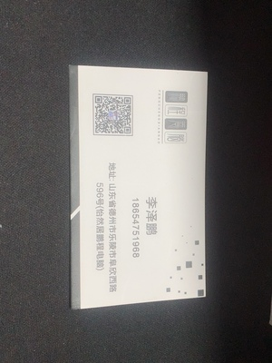
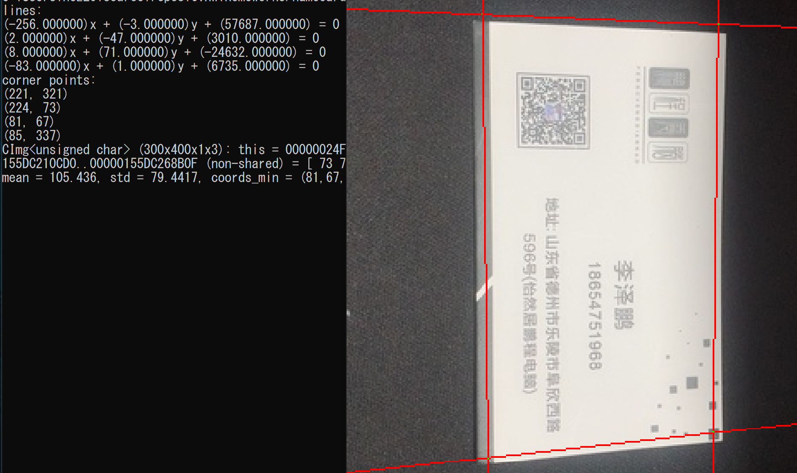
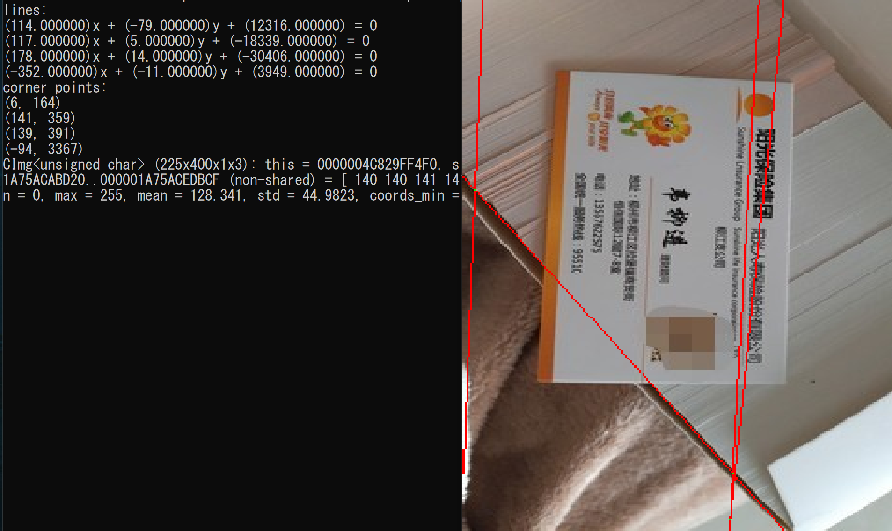

# Homework 3 - 检测名片
17364025 贺恩泽
## 实现方案
为了实现名片的检测，需要先检测出名片的边缘信息，然后从中找出名片的外轮廓边缘。为此，代码中采用了如下方案进行实现：

1. 对读入的图片进行 Canny 边缘检测
2. 利用 RANSAC 算法对直线进行拟合

由于 RANSAC 算法每次只能找出一条直线，因此在找到一条直线后，就立即将该条直线从边缘信息中删除，重复 4 次即可找出名片的四条边框。

得到边框后计算直线的交点信息，便能找出 4 个角点。

## 代码实现
代码中，利用 `std::tuple<double, double, double>` 这样的三元组表示一条直线，分别为直线一般方程中的 A、B 和 C；利用 `std::pair<int, int>` 这样的二元组表示一个点，分别为 x、y 坐标。

### 一些辅助函数
首先需要一些辅助函数用于：
- 计算点到直线距离
- 根据两点计算直线方程
- 计算两直线交点

```cpp
// 计算点到直线距离
double Utils::calc_distance(int x, int y, double a, double b, double c)
{
    return std::abs(a * x + b * y + c) / std::sqrt(std::pow(a, 2) + std::pow(b, 2));
}

// 计算直线方程
std::tuple<double, double, double> Utils::calc_line(std::pair<int, int> p1, std::pair<int, int> p2)
{
    auto x1 = p1.first, x2 = p2.first, y1 = p1.second, y2 = p2.second;
    return std::make_tuple(y2 - y1, x1 - x2, x2 * y1 - x1 * y2);
}

// 计算交点
std::pair<int, int> Utils::calc_cpoint(std::tuple<double, double, double> line1, std::tuple<double, double, double> line2) {
    auto a1 = std::get<0>(line1), b1 = std::get<1>(line1), c1 = std::get<2>(line1);
    auto a2 = std::get<0>(line2), b2 = std::get<1>(line2), c2 = std::get<2>(line2);

    // 无交点
    if (a1 * b2 == a2 * b1) {
        return std::make_pair(2147483647, 2147483647);
    }

    return std::make_pair(
        (int)((c2 * b1 - c1 * b2) / (a1 * b2 - a2 * b1)),
        (int)((c1 * a2 - c2 * a1) / (a1 * b2 - a2 * b1))
    );
}
```

### Canny
Canny 边缘检测算法在 Homework 2 中已进行实现，因此此处不再赘述。

### RANSAC

RANSAC：在图像中随机采样，计算两点所代表的直线后，验证其他点到该条直线的距离是否在阈值以内，反复迭代最后返回在阈值以内数量最多的点对应的直线方程。

```cpp
// ransac
std::tuple<double, double, double> NameCard::ransac(CImg<u8>& contours, int iter_cnt) {
    std::tuple<double, double, double> ret_line;
    int width = contours.width();
    int height = contours.height();

    std::vector<std::pair<int, int>> max_result;

    while (iter_cnt--) {
        // 随机采样
        std::pair<int, int> p1, p2;
        do {
            p1 = std::make_pair(rand() % width, rand() % height);
        } while (*contours.data(p1.first, p1.second) == 0);
        do {
            p2 = std::make_pair(rand() % width, rand() % height);
        } while (*contours.data(p1.first, p1.second) == 0 || (p1.first == p2.first && p1.second == p2.second));

        // 计算直线方程
        auto line = Utils::calc_line(p1, p2);
        auto result = check(contours, p1, p2, line);
        if (result.size() > max_result.size()) {
            max_result = result;
            ret_line = line;
        }
    }

    // 将检测出的直线删除
    for (auto& i : max_result) {
        *contours.data(i.first, i.second) = 0;
    }

    return ret_line;
}

// ransac - 检查其他点
std::vector<std::pair<int, int>> NameCard::check(CImg<u8>& contours, std::pair<int, int> p1, std::pair<int, int> p2, std::tuple<double, double, double> line) {
    std::vector<std::pair<int, int>> points;
    int width = contours.width();
    int height = contours.height();

    for (int i = 0; i < width; i++) {
        for (int j = 0; j < height; j++) {
            // 排除作为采样的点
            if (i == p1.first && j == p1.second) continue;
            if (i == p2.first && j == p2.second) continue;
            if (*contours.data(i, j) > 0) {
                // 计算距离
                auto distance = Utils::calc_distance(i, j, std::get<0>(line), std::get<1>(line), std::get<2>(line));
                if (distance <= 2) {
                    points.push_back(std::make_pair(i, j));
                }
            }
        }
    }

    return points;
}
```

至此，便能找出名片的边框了。

接下来寻找边框的角点：

## 角点寻找
有了四条直线后，依次计算两两直线的交点，如果交点不存在，则使用 (∞, ∞) 来代替交点。

计算完交点后，按照距离图像中心点的距离从近到远排序，然后按顺序进行交点的选择，对于每一个交点：

1. 如果未选中该交点，判断该交点所对应的两条直线被选中次数是否已够2次，如果不是则选中，否则不选
2. 如果四条直线每一条都被恰好选中了 2 次，则对应的交点即为名片的四个角点

```cpp
// 寻找四个角点
void find_matches(std::vector<std::pair<std::pair<int, int>, std::pair<int, int>>>& src, int* count, int step, int* result, bool &found, bool* selected) {
    if (found || step == 4) return;

    int len = src.size();
    for (int i = 0; i < len; i++) {
        // 如果未选中并且对应直线选中次数小于 2
        if (!selected[i] && count[src[i].first.first] > 0 && count[src[i].first.second] > 0) {
            // 选中
            result[step] = i;
            selected[i] = true;
            count[src[i].first.first]--;
            count[src[i].first.second]--;
            // 如果 4 个交点选完了，并且每一条直线恰好被选中了 2 次则完毕
            if (step == 3 && count[0] == 0 && count[1] == 0 && count[2] == 0 && count[3] == 0) {
                found = true;
                return;
            }
            find_matches(src, count, step + 1, result, found, selected);
            // 回溯
            selected[i] = false;
            count[src[i].first.first]++;
            count[src[i].first.second]++;
        }
        if (found) break;
    }
}

int main(int argc, char** argv)
{
    ...
    // (两条直线的编号, 两条直线的交点)[]
    auto cpoints = std::vector<std::pair<std::pair<int, int>, std::pair<int, int>>>();

    for (int i = 0; i < 4; i++) {
        for (int j = i + 1; j < 4; j++) {
            cpoints.push_back(std::make_pair(std::make_pair(i, j), Utils::calc_cpoint(lines[i], lines[j])));
        }
    }

    int cx = card.get().width() / 2;
    int cy = card.get().height() / 2;

    // 按照交点距离图像中心的距离从近到远排序
    sort(cpoints.begin(), cpoints.end(), [cx, cy](std::pair<std::pair<int, int>, std::pair<int, int>>& a, std::pair<std::pair<int, int>, std::pair<int, int>>& b) -> bool
        {
            double d1 = std::pow(a.second.first - cx, 2) + std::pow(a.second.second - cy, 2);
            double d2 = std::pow(b.second.first - cx, 2) + std::pow(b.second.second - cy, 2);

            return d1 < d2;
        });

    // 每条直线应当恰好被选中两次
    int count[] = { 2,2,2,2 };
    // 存储选中的交点
    int result[4] = { 0,0,0,0 };
    // 记录交点是否被选中
    bool selected[] = { false,false,false,false,false,false };
    bool found = false;
    find_matches(cpoints, count, 0, result, found, selected);

    ...
}

```

## 运行测试
使用该名片进行测试：



运行：

```bash
namecard input1.bmp
```

结果：



可以看到四条直线方程和四个角点都被计算了出来。

图中你使用绿色的点标记出了四个角点，效果不错。

但是对于背景信息较为杂乱的图片而言，则不能很好的识别，例如如下输入：


运行：

```bash
namecard input2.bmp
```

结果：



可以发现程序将背景中的箱子边缘以及名片上标题下的横线错误的识别成为名片边框。

## 思考
### 如何在保证精度的前提下加快运行速度。

1. 对于识别名片边框而言，边缘信息是最重要的，而内容则不是。因此可以先将图片缩放到一个比较小的大小，然后再进行计算，这样计算量将可以大范围减小，同时边缘信息仍然能保留下来。

2. 可以适当减少 RANSAC 的迭代次数。

