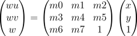
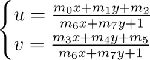
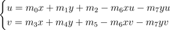
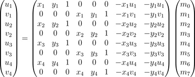
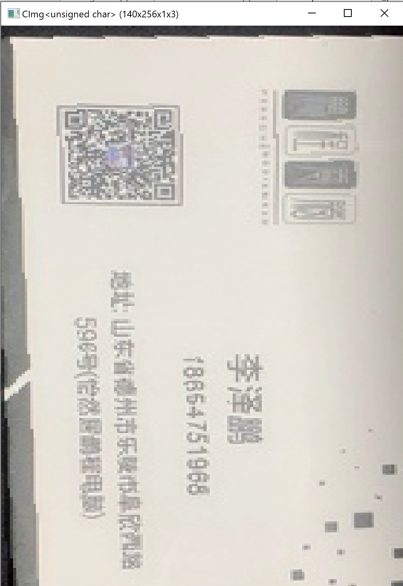
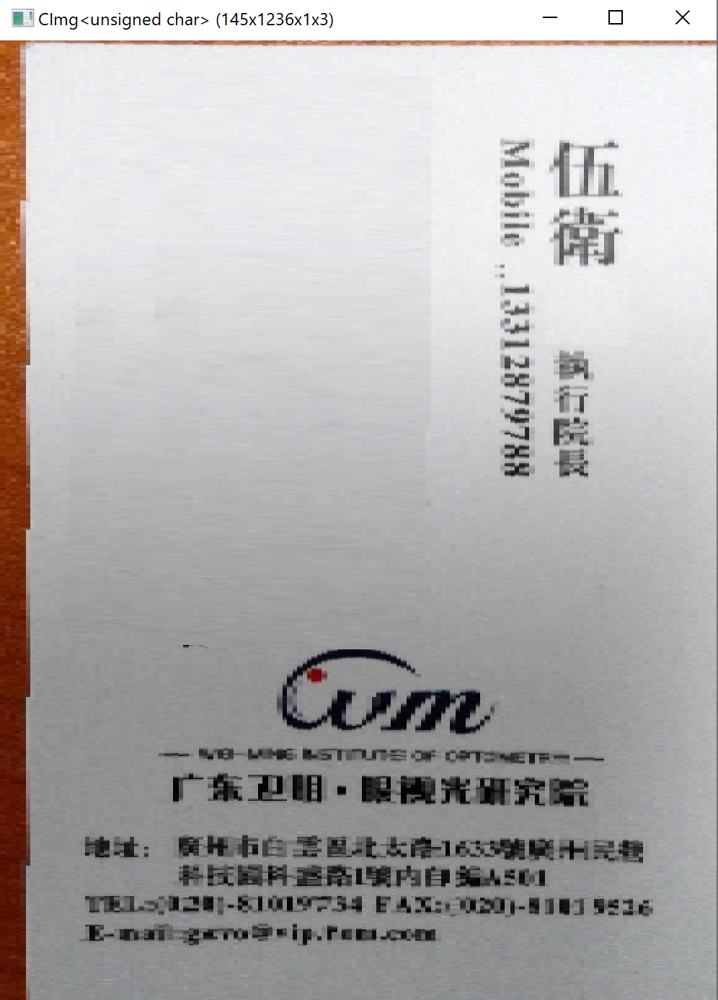

# Homework 4 - 名片矫正
17364025 贺恩泽
## 实现方案
为了实现名片的检测，需要先检测出名片的边缘信息，然后从中找出名片的外轮廓边缘。为此，代码中采用了如下方案进行实现：

1. 对读入的图片进行 Canny 边缘检测
2. 利用 RANSAC 算法对直线进行拟合

由于 RANSAC 算法每次只能找出一条直线，因此在找到一条直线后，就立即将该条直线从边缘信息中删除，重复 4 次即可找出名片的四条边框。

得到边框后计算直线的交点信息，便能找出 4 个角点。

上述实现方案与 Homework 3 大体相同，但是本次实现中做了很多处改进。

得到 4 个角点后，对图像应用透视变换即可得到最终的图像。

## 名片检测相对于 Homework 3 的改进
Homework 3 中的实现，对于很多图片来说结果都不够理想。因此本次实现做出了如下的改进：

1. 增加 RANSAC 迭代次数：

    ```cpp
    auto line = card.ransac(contours, 4000);
    ```

    迭代次数从 1000 增加至 4000，使得能有更大的概率获得正确的直线拟合结果。但是相应的速度就会变慢。

2. 使用更小的阈值拟合直线：

    ```cpp
    auto distance = Utils::calc_distance(i, j, std::get<0>(line), std::get<1>(line), std::get<2>(line));
    if (distance <= 1) {
        points++;
    }
    ```

    RANSAC 阈值从 2 减到 1，使得内点的候选减少，也使得拟合更加精确。

3. 使用更大的阈值删除检测出的直线：

    ```cpp
    auto distance = Utils::calc_distance(i, j, std::get<0>(line), std::get<1>(line), std::get<2>(line));
    if (distance <= 3) {
        *contours.data(i, j) = 0;
    }
    ```

    如果检测出直线，为了避免后续重复检测出该直线，使用一个更大的阈值将和该直线相邻的点清除。

4. 修改 Canny 检测参数并移除短边缘：

    ```cpp
    canny.detect(image, 3, 40, 100)
    ```
    ```cpp
    auto final_result = link_contours(thres_result);
    return final_result;
    ```

    这使得检测出来的边缘受二维码、文字和噪声等的影响减少，而将直线边缘突出。

5. 加入直线斜率检测：

    ```cpp
    std::vector<std::tuple<double, double, double>> lines;
    int hori = 2, vert = 2;
    for (int i = 0; i < 4; i++) {
        auto line = card.ransac(contours, 4000);
        auto k = std::abs(Utils::calc_kvalue(line));
        // 横线
        if (k < 1) {
            if (hori <= 0) {
                i--;
                continue;
            }
            hori--;
        }
        // 竖线
        else {
            if (vert <= 0) {
                i--;
                continue;
            }
            vert--;
        }
        lines.push_back(line);
    }
    ```

    由于检测出的名片边框应该有 2 条水平和 2 条竖直的直线，因此在代码中加以限定，直到找出足够数量的横、竖直线为止，这样做可以避免检测出大于 2 条的横线或竖线。

## 透视变换
检测出名片边框和角点后，对其应用透视变换。

透视变换是在给定的两个四边形 `{(x1,y1),(x2,y2),(x3,y3),(x4,y4)}` 和 `{(u1,v1),(u2,v2),(u3,v3),(u4,v4)}` 之间，寻找一种关系使得第一个四边形的一点能够映射到第二个四边形中。

透视变换的矩阵形式为：



因此，需要求解出 `m0` 到 `m7`，已知两个四边形的共 8 个顶点坐标，正好可以构建出 8 个方程，可以解出对于每一个第一个四边形中的坐标 `(x,y)`，映射到第二个四边形的坐标 `(u,v)` 为：



变形一下得到：



构造出变换矩阵：



因此要做的只需要将等式右边的左边的矩阵求逆，左乘等号左边的矩阵即可得到所需要的 8 个参数。

代码实现如下：

```cpp
PerspectiveParams Transform::prepare_perspective_transform(Rect from, Rect to) {
    auto x1 = std::get<0>(from).first;
    auto x2 = std::get<1>(from).first;
    auto x3 = std::get<2>(from).first;
    auto x4 = std::get<3>(from).first;
    auto y1 = std::get<0>(from).second;
    auto y2 = std::get<1>(from).second;
    auto y3 = std::get<2>(from).second;
    auto y4 = std::get<3>(from).second;
    auto u1 = std::get<0>(to).first;
    auto u2 = std::get<1>(to).first;
    auto u3 = std::get<2>(to).first;
    auto u4 = std::get<3>(to).first;
    auto v1 = std::get<0>(to).second;
    auto v2 = std::get<1>(to).second;
    auto v3 = std::get<2>(to).second;
    auto v4 = std::get<3>(to).second;

    // 构造矩阵
    double** data = new double*[] {
        new double[] {x1,y1,1,0,0,0,-x1*u1,-y1*u1},
        new double[] {0,0,0,x1,y1,1,-x1*v1,-y1*v1},
        new double[] {x2,y2,1,0,0,0,-x2*u2,-y2*u2},
        new double[] {0,0,0,x2,y2,1,-x2*v2,-y2*v2},
        new double[] {x3,y3,1,0,0,0,-x3*u3,-y3*u3},
        new double[] {0,0,0,x3,y3,1,-x3*v3,-y3*v3},
        new double[] {x4,y4,1,0,0,0,-x4*u4,-y4*u4},
        new double[] {0,0,0,x4,y4,1,-x4*v4,-y4*v4}
    };
    auto transform_matrix = Matrix(data, 8, 8);
    // 求逆
    auto inv_matrix = transform_matrix.inverse();

    double** right = new double*[] { new double[] {u1},new double[] {v1},new double[] {u2},new double[] {v2},new double[] {u3},new double[] {v3},new double[] {u4},new double[] {v4} };
    auto right_matrix = Matrix(right, 8, 1);
    // 左乘
    auto multiplied = inv_matrix * right_matrix;
    // 得到 m0~m7
    auto result = std::make_tuple(multiplied(0, 0), multiplied(1, 0), multiplied(2, 0), multiplied(3, 0), multiplied(4, 0), multiplied(5, 0), multiplied(6, 0), multiplied(7, 0));
    for (int i = 0; i < 8; i++) {
        delete[] data[i];
        delete[] right[i];
    }
    delete[] data;
    delete[] right;
    return result;
}

// 对一点应用变换参数
Point Transform::apply_perspective_transform(Point origin, PerspectiveParams params) {
    double m0 = std::get<0>(params);
    double m1 = std::get<1>(params);
    double m2 = std::get<2>(params);
    double m3 = std::get<3>(params);
    double m4 = std::get<4>(params);
    double m5 = std::get<5>(params);
    double m6 = std::get<6>(params);
    double m7 = std::get<7>(params);
    double x = origin.first, y = origin.second;
    return std::make_pair(
        (m0 * x + m1 * y + m2) / (m6 * x + m7 * y + 1),
        (m3 * x + m4 * y + m5) / (m6 * x + m7 * y + 1)
    );
}
```

但是这样还不够，因为如果采用正向变换，会导致变换后的图片中出现很多的“洞”，这是由于经过变换的每个点在新的图片中并不一定会相邻。因此需要采用反向变换：取变换后图形中的每一个点，计算原来对应的位置，然后复制其颜色值。代码实现如下：

```cpp
int width = std::get<2>(to).first - std::get<0>(to).first;
int height = std::get<1>(to).second - std::get<0>(to).second;
int left = std::get<0>(to).first;
int top = std::get<0>(to).second;
int channel = image.spectrum();
CImg<u8> transformed = CImg<u8>(width, height, 1, channel);
// 反向变换
auto inv_params = Transform::prepare_perspective_transform(to, from);
for (int i = left; i < left + width; i++) {
    for (int j = top; j < top + height; j++) {
        // 对新的点，求出原来的点
        auto point = Transform::apply_perspective_transform(std::make_pair(i, j), inv_params);
        if (!(point.first >= 0 && point.first < image.width()
            && point.second >= 0 && point.second < image.height())
        ) continue;
        // 如果没有超出图像边界则复制颜色值
        for (int c = 0; c < channel; c++) {
            *transformed.data(i, j, 0, c) = *image.data(point.first, point.second, 0, c);
        }
    }
}
```

## 测试
接下来选取两张图像进行测试，分别是 `18654751968+李泽鹏.bmp` 和 `13310879788+伍卫.bmp`：

`18654751968+李泽鹏.bmp`：

```bash
namecard.exe 18654751968+李泽鹏.bmp
```



`13310879788+伍卫.bmp`：

```bash
namecard.exe 13310879788+伍卫.bmp
```



可以看到效果还是不错的。