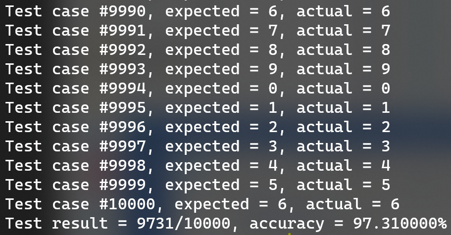
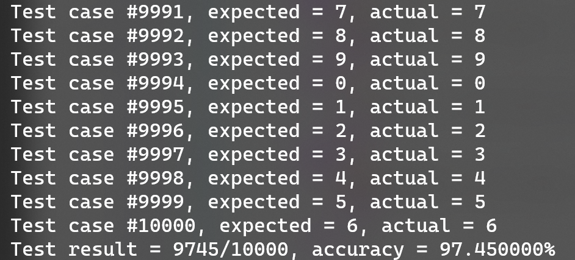
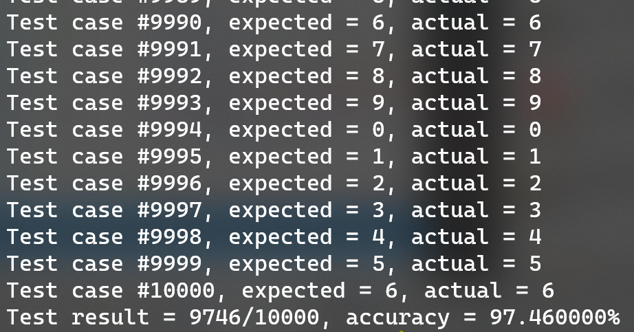
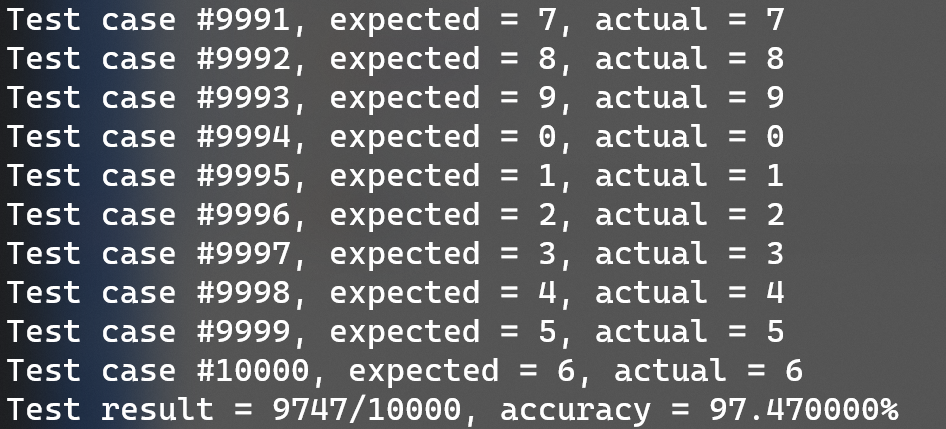
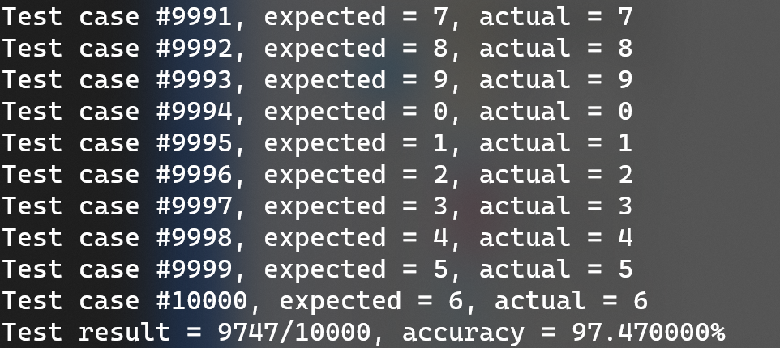
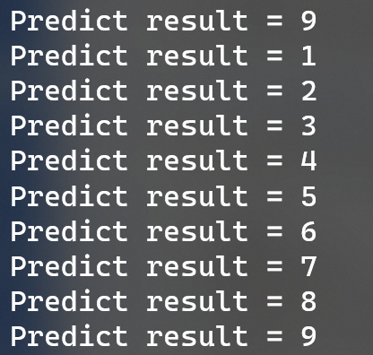

# Homework 5
MNIST 手写数字识别

## 分类器方案
选用 SVM 作为分类器。

## MNIST 数据读取
MNIST 数据格式为：MAGIC|NUM|ROW|COL|DATA...

MNIST 标签格式为：MAGIC|NUM|DATA...

因此，首先需要提取出MAGIC、NUM等信息：

```cpp
label = new std::ifstream(labelFileName, std::ios::binary);
data = new std::ifstream(dataFileName, std::ios::binary);

int label_magic_number = 0;
int label_number_of_images = 0;
if (label->is_open()) {
    label->read((char*)&label_magic_number, sizeof(label_magic_number));
    label_magic_number = reverse_int(label_magic_number);
    label->read((char*)&label_number_of_images, sizeof(label_number_of_images));
    label_number_of_images = reverse_int(label_number_of_images);
}

...
```

然后剩余的数据可以在每次迭代时读取：

```cpp
bool DataReader::move_next(u8* labelOut, CImg<u8>* dataOut) {
    if (data == nullptr || label == nullptr || !data->is_open() || !label->is_open()) {
        return false;
    }
    if (current >= count) {
        return false;
    }
    u8* buffer = new u8[rows * cols];
    label->read((char*)labelOut, 1);
    dataOut->clear();
    dataOut->resize(rows, cols, 1, 1);
    data->read((char*)buffer, rows * cols);
    for (int i = 0; i < rows; i++) {
        for (int j = 0; j < cols; j++) {
            *(dataOut->data(j, i)) = buffer[i * rows + j];
        }
    }
    delete[] buffer;
    current++;
    return true;
}
```

## 数据训练
采用 SVM 作为分类器。

### 特征选取
将图像数据按照 2*2 做平均值池化，然后以 100 为阈值对其进行二值化得到的结果作为特征：

```cpp
svm_problem prob = {};
prob.l = reader.get_size();
prob.x = new svm_node * [prob.l];
prob.y = new double[prob.l];

int index = 0;
while (reader.move_next(&label, &image)) {
    prob.x[index] = new svm_node[size / 4 + 1];
    for (int i = 0; i < rows / 2; i++) {
        for (int j = 0; j < cols / 2; j++) {
            prob.x[index][i * rows / 2 + j].index = i * rows / 2 + j + 1;
            prob.x[index][i * rows / 2 + j].value =
                (*image.data(i * 2, j * 2) +
                    *image.data(i * 2, j * 2 + 1) +
                    *image.data(i * 2 + 1, j * 2) +
                    *image.data(i * 2 + 1, j * 2 + 1)) / 4
                >= 100 ? 1 : 0;
        }
    }
    prob.x[index][size / 4].index = -1;
    prob.y[index] = label;
    index++;
}
```

### 参数选取
使用 RBF 作为核函数，C 分别选取 1、5、10、20 和 100 进行测试，gamma 选取 0.09：

```cpp
svm_parameter param = {};
param.C = 10;
param.gamma = 0.09;
param.coef0 = 1;
param.nu = 0.5;
param.p = 1;
param.degree = 10;
param.eps = 1e-3;
param.svm_type = C_SVC;
param.kernel_type = RBF;
param.cache_size = 512;
```

## 训练和测试
1. 运行 `hw5.exe train ./datasets/train-labels.idx1-ubyte ./datasets/train-images.idx3-ubyte data.model` 将 train 数据作为训练集，将结果保存到 data.model 中。

2. 运行 `hw5.exe test ./datasets/t10k-labels.idx1-ubyte ./datasets/t10k-images.idx3-ubyte data.model` 使用上一步训练好的模型，对测试集进行测试。

测试结果如下：

C = 1：



C = 5：



C = 10：



C = 20：



C = 100：



C = 100 和 C = 20 对于测试集的结果相同，考虑到 C 继续增大可能会导致过拟合，因此将 C 定为 20。

## 手写数字预测
手写了 0~9 共 10 个数字，存放于 images 目录下，对其应用上面训练好的模型进行预测：

```pwsh
# powershell
for ($i = 0; $i -le 9; $i++) {
  ./hw5.exe predict images/$i.bmp data.model
}
```

结果如下：



可以看到除了 0 之外都识别正确。
