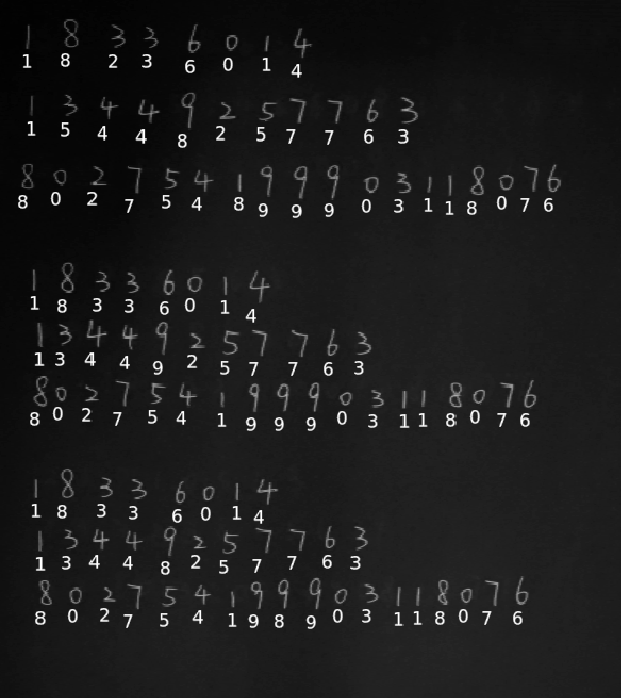
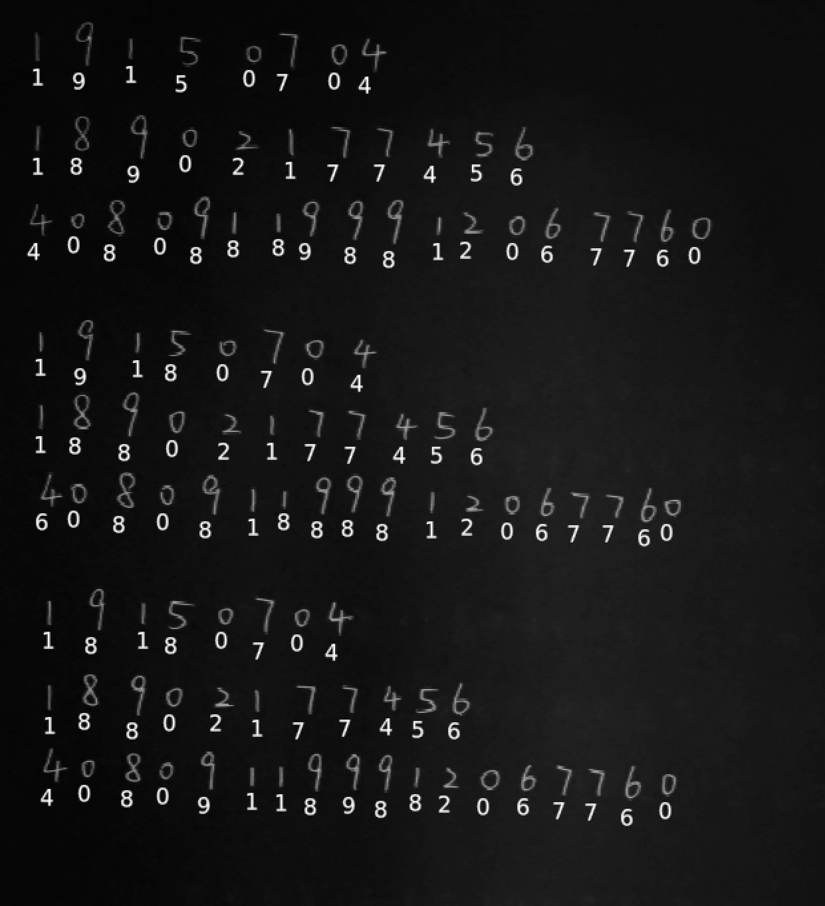

# 手写数字识别
17364025 贺恩泽

## 设计
对一张完整 A4 纸上手写的数字进行识别的流程大致如下：

1. 识别 A4 纸的位置
2. 利用透视变换将 A4 纸切割出来
3. 识别每一个数字的位置
4. 分别切割出每一个数字
5. 将切割出的数字拿去识别

接下来说明对于上述每一个步骤的实现。

### 识别 A4 纸的位置
由于照相机拍摄的图片较大，因此需要对其进行缩放。因为大部分摄像机采用 4:3 的比例进行拍照，而 AA 纸为 3:2，拍摄时会将 A4 纸纵向拍摄，因此比例将会为 3:4，所以缩放为 600*800 较为合适。

然后利用 Canny 变换可以找出图片中的所有边缘，然后再对边缘信息利用 Hough 变换，找出其中长度大于 200 的直线。这样一来，A4 纸与环境之间的边界便包含在了识别出的直线中。

```cpp
printf("[Info] Loading image: %s...\n", *(argv + 1));
CImg<u8> image = CImg<u8>(*(argv + 1));
image = image.resize(600, 800, image.depth(), image.spectrum(), 3);

printf("[Info] Processing contours detection...\n");
Canny canny;
auto contours = canny.detect(image, 1, 50, 80);

printf("[Info] Processing lines detection...\n");

Hough hough(kAngleSplits);
int w = contours.width(), h = contours.height();

auto result = hough.detect(contours, 200);

printf("[Info] Found %d lines\n", (int)result.size());
```

由于一条边缘可能会被检测多次，与其考虑如何筛选边缘，不如计算所有直线的交点后筛选正确的角点。

首先两两计算直线的交点，过滤掉那些位置距离图片的边界过于远的点：

```cpp
printf("[Info] Processing corners detection...\n");
int diagonal = (int)sqrt(w * w + h * h);
int len = result.size();
vector<Point> intersections = {};
for (int i = 0; i < len; i++) {
    for (int j = 0; j < i; j++) {
        int t1 = get<0>(result[i]), r1 = get<1>(result[i]) - diagonal;
        int t2 = get<0>(result[j]), r2 = get<1>(result[j]) - diagonal;
        auto inter = Utils::get_intersection(hough, t1, r1, t2, r2);
        if (inter.first < -w / 2 || inter.first > 3 * w / 2) continue;
        if (inter.second < -h / 2 || inter.second > 3 * h / 2) continue;
        intersections.push_back(inter);
    }
}
```

然后利用并查集，将距离相近的点合并为一组，取每组第一个点作为候选：

```cpp
int intersLen = intersections.size();
UFS ufs = UFS(intersLen);
for (int i = 0; i < intersLen; i++) {
    for (int j = 0; j < i; j++) {
        auto& point1 = intersections[i];
        auto& point2 = intersections[j];
        if (sqrt(pow(point1.first - point2.first, 2) + pow(point1.second - point2.second, 2)) < 100) {
            ufs.merge(i, j);
        }
    }
}
unordered_map<int, vector<Point>> cornersGroup = {};
vector<Point> corners = {};

for (int i = 0; i < intersLen; i++) {
    int f = ufs.find(i);
    if (!cornersGroup.count(f)) cornersGroup[f] = {};
    cornersGroup[f].push_back(intersections[i]);
}

for (auto& i : cornersGroup) {
    corners.push_back(*i.second.begin());
}

for (auto& i : corners) {
    printf("[Info] Found candidate corner: (%lf, %lf)\n", i.first, i.second);
}
```

由于 A4 纸在图片内位置的特殊性，相较于整张图片的 4 个顶点会分别有一个距离最近的点，因此可以根据这一特征进行筛选，`get_corner_type` 用于判断一个点距离图片的哪个顶点最近。

```cpp
bool cornerMatched[] = { false,false,false,false };
vector<Point> sortedCorners = {};
for (auto& i : corners) {
    auto type = get_corner_type(i, w, h);
    if (!cornerMatched[type]) {
        sortedCorners.push_back(i);
        cornerMatched[type] = true;
    }
}
```

这样找出来的 4 个点就是 A4 纸的 4 个角点了。

### 透视变换
透视变换需要将 4 个角点的位置与变换后的位置对齐，因此需要按照一定规则对上一步骤找出的角点进行排序，排序规则很简单，只需要根据横纵坐标之和进行排序即可，这样距离左上角和右下角最近的点自然会成为第一个和最后一个点。

然后进行透视变换即可，透视变换后的大小需要根据四个角点的位置，利用距离公式计算出实际大小。

考虑到可能拍摄的时候没有将边界拍摄到照片中，因此如果角点不够，则直接将拍摄的照片作为变换后的图片，而无需进行透视变换。

```cpp
CImg<u8> transformed;

if (sortedCorners.size() >= 4) {
    sort(sortedCorners.begin(), sortedCorners.end(), [w, h](Point& a, Point& b) -> bool {
        return a.first + a.second < b.first + b.second;
        });

    for (auto& i : sortedCorners) {
        printf("[Info] Filtered and sorted corner: (%lf, %lf)\n", i.first, i.second);
    }

    printf("[Info] Processing perspective transform...\n");

    double transformedWidth = sqrt(pow(sortedCorners[2].second - sortedCorners[0].second, 2) + pow(sortedCorners[2].first - sortedCorners[0].first, 2));
    double transformedHeight = sqrt(pow(sortedCorners[3].second - sortedCorners[0].second, 2) + pow(sortedCorners[3].first - sortedCorners[0].first, 2));

    transformed = Transform::perspective_transform(
        image,
        std::make_tuple(
            sortedCorners[0],
            sortedCorners[1].first < sortedCorners[2].first ? sortedCorners[1] : sortedCorners[2],
            sortedCorners[1].first < sortedCorners[2].first ? sortedCorners[2] : sortedCorners[1],
            sortedCorners[3]
        ),
        std::make_tuple(
            std::make_pair(0, 0),
            std::make_pair(0, transformedHeight),
            std::make_pair(transformedWidth, 0),
            std::make_pair(transformedWidth, transformedHeight)
        )
    );
}
else {
    transformed = CImg<u8>(image);
}
```

最终效果如下：


### 识别每一个数字的位置
首先将图片变成灰度，由于边缘检测检测的是亮度较大的部分，而此时需要检测的数字是使用黑色的笔书写的，因此需要将图片反色后检测。

考虑到检测后的边缘中，一个数字可能会被分割成多个部分，因此首先进行一次 1*10 的膨胀操作，将边缘信息纵向膨胀。

```cpp
printf("[Info] Processing regions detection...\n");

CImg<u8> processed = Utils::rect(Utils::inverse(Utils::luminance(transformed)), 10, 10, 10, 10);

auto contours2 = canny.detect(processed, 1, 50, 80).dilate(1, 10);
```

效果如下：


然后利用广度优先搜索，使用 2*2 大小的窗口在图像上移动，找出每一个连通区域。

```cpp
vector<pair<int, int>> get_region(CImg<u8>& img, CImg<bool>& map, int x, int y) {
    vector<pair<int, int>> result = {};
    queue<pair<int, int>> q = {};

    const int dx[] = { 1,-1,0,0 };
    const int dy[] = { 0,0,1,-1 };
    // 广度优先搜索
    q.push(make_pair(x, y));
    *map.data(x, y) = true;
    while (!q.empty()) {
        auto& f = q.front();
        q.pop();
        result.push_back(f);
        for (int i = 0; i < 4; i++) {
            int fx = f.first + dx[i], fy = f.second + dy[i];
            if (fx < 0 || fx >= img.width() - 1 || fy < 0 || fy >= img.height() - 1) continue;
            // count_region 用于使用 2*2 的窗口计算包含像素的点数量
            if (!(*map.data(fx, fy)) && count_region(img, fx, fy)) {
                *map.data(fx, fy) = true;
                q.push(make_pair(fx, fy));
            }
        }
    }

    return result;
}

vector<vector<pair<int, int>>> find_regions(CImg<u8> img) {
    CImg<u8> clone = CImg<u8>(img);
    vector<vector<pair<int, int>>> result = {};

    CImg<bool> map = CImg<bool>(img.width(), img.height());
    for (int i = 0; i < img.width(); i++) {
        for (int j = 0; j < img.height(); j++) {
            *map.data(i, j) = false;
        }
    }

    for (int i = 0; i < img.width() - 1; i++) {
        for (int j = 0; j < img.height() - 1; j++) {
            // 如果找到了 2*2 窗口内像素点数量大于 2 的位置则以该位置为起点进行搜索，找出连通区域
            if (count_region(clone, i, j) >= 2) {
                auto region = get_region(clone, map, i, j);
                if (region.size() > 0) {
                    // 将找到的区域设置为 0
                    for (auto& x : region) {
                        *clone.data(x.first, x.second) = 0;
                    }
                    result.push_back(region);
                }
            }
        }
    }
    return result;
}
```

最后，过滤掉太大和太小的部分，剩下的便是找出的每一个数字的位置：

```cpp
const unsigned char color[] = { 255 };
auto regions = find_regions(contours2);

vector<tuple<int, int, int, int>> digits = {};
for (auto& i : regions) {
    int minX = contours2.width() - 1, minY = contours2.height() - 1, maxX = 0, maxY = 0;
    for (auto& j : i) {
        minX = min(minX, j.first);
        minY = min(minY, j.second);
        maxX = max(maxX, j.first);
        maxY = max(maxY, j.second);
    }
    auto chWidth = maxX - minX, chHeight = maxY - minY;
    if (chWidth < 3 || chHeight < 3 || chWidth > 50 || chHeight > 50) continue;
    printf("[Info] Located bounding box: (%d, %d, %d, %d)\n", minX, minY, maxX, maxY);
    digits.push_back(make_tuple(minX, minY, maxX, maxY));
}
```

识别结果如下：


然后再次利用并查集，对高度相近的区域合并为一组，作为一行，便能有序的找出每一行的数字。

```cpp
UFS digitsLines(digits.size());
for (int i = 0; i < digits.size(); i++) {
    for (int j = 0; j < i; j++) {
        if (abs((get<1>(digits[i]) + get<3>(digits[i])) / 2 - (get<1>(digits[j]) + get<3>(digits[j])) / 2) <= 10) {
            digitsLines.merge(i, j);
        }
    }
}

map<int, vector<tuple<int, int, int, int>>> groupedDigits = {};
for (int i = 0; i < digits.size(); i++) {
    int index = digitsLines.find(i);
    if (!groupedDigits.count(get<1>(digits[index]))) groupedDigits[get<1>(digits[index])] = {};
    groupedDigits[get<1>(digits[index])].push_back(digits[i]);
}
```

### 分别切割出每一个数字
将上一步骤的结果，每一组内按照横坐标进行从左到右的排序，然后依此进行切割即可得到单个数字，然后依次送去识别即可。注意到上一步识别出的数字的边框普遍数字左侧空白区域较大，而右侧空白区域较小（膨胀操作导致），因此实际切割的时候将宽度向右增加 3。

```cpp
CImg<u8> predicted = CImg<u8>(processed);
char* text = new char[10];

for (auto& i : groupedDigits) {
    printf("[Info] Line prediction result: ");
    sort(i.second.begin(), i.second.end(), [](tuple<int, int, int, int>& a, tuple<int, int, int, int>& b) -> bool {
        return get<0>(a) < get<0>(b);
        });

    for (auto& j : i.second) {
        auto digitRect = Utils::rect(processed, get<0>(j), get<1>(j), processed.width() - get<2>(j) - 3, processed.height() - get<3>(j));
        // 将切割出的数字送去识别
        auto predictResult = predict(digitRect, model);
        printf("%d", predictResult);
        memset(text, 0, 10 * sizeof(char));
        text = itoa(predictResult, text, 10);
        predicted.draw_text(get<0>(j), get<3>(j), text, color, 0, 1, 20);
    }
    printf("\n");
}

delete[] text;
```

切割结果如下：


### 识别
识别过程首先需要对上一步的输入进行处理，构建一个 28*28 的图像。

构建方法不能直接采用缩放，而是通过按比例将输入缩放到长或宽最大为 24 的程度，然后补全到 28*28 即可。

由于手写数字相较于 MNIST 中的数据更直更瘦一些，因此缩放的时候将宽度变为原来的 1.4 倍，再顺时针旋转 5 度。

```cpp
constexpr int cols = 28, rows = 28;
constexpr int size = cols * rows;
CImg<u8> image = CImg<u8>(rows, cols);
for (int i = 0; i < rows; i++) {
    for (int j = 0; j < cols; j++) {
        *image.data(i, j) = 0;
    }
}

// 等比例缩放，计算比例系数
double factor = max(input.width() / 24.0, input.height() / 24.0);
// 缩放，并将宽度变为原来的 1.4 倍
input = input.resize(input.width() / factor * 1.4, input.height() / factor, input.depth(), input.spectrum(), 3);

map<int, int> dis = {};

// 补全
int offsetX = (rows - input.width()) / 2, offsetY = (cols - input.height()) / 2;
for (int i = 2; i < input.width(); i++) {
    for (int j = 2; j < input.height(); j++) {
        int x = offsetX + i - 2, y = offsetY + j - 2;
        if (x < 0 || y < 0 || x >= rows || y >= cols) continue;
        *image.data(x, y) = *input.data(i, j);
        dis[*input.data(i, j)]++;
    }
}

image = image.rotate(5);
```

由于背景不是纯黑色，需要统计所有像素点的亮度值，然后取出现次数最多的亮度值作为背景亮度，然后把数字部分单独拿出来进行增强。

之所以需要增强，是因为手写拍照出来的数字往往亮度不够，因此将整体亮度向上抬，直到最高亮度为 255 即可。

```cpp
// 最多出现的亮度值的次数，对应的亮度值，最大的亮度值，3/5 处的亮度值，计数
int maxGray = 0, kmax = 0, vmax = 0, ksplit = 0, cnt = 0;
for (auto& i : dis) {
    if (i.second > maxGray) {
        maxGray = i.second;
        kmax = i.first;
    }
    if (i.second > 0) {
        vmax = i.first;
    }
    if (cnt++ == dis.size() * 3 / 5) {
        ksplit = i.first;
    }
}

// 过滤背景，并抬高有效内容的亮度
for (int i = 0; i < image.width(); i++) {
    for (int j = 0; j < image.height(); j++) {
        *image.data(i, j) = *image.data(i, j) >= kmax + 10 ? *image.data(i, j) + 255 - vmax : 0;
    }
}
```

增强结果如下：


最后将上述处理完成的图片提取特征并送去 SVM 进行预测即可。

```cpp
// 14*14 的特征
CImg<u8> feature = CImg<u8>(14, 14);

svm_node* node = new svm_node[size / 4 + 1];
// 2*2 最大池化
for (int i = 0; i < rows / 2; i++) {
    for (int j = 0; j < cols / 2; j++) {
        node[i * rows / 2 + j].index = i * rows / 2 + j + 1;
        auto value = max(max(max(*image.data(i * 2, j * 2),
            *image.data(i * 2, j * 2 + 1)),
            *image.data(i * 2 + 1, j * 2)),
            *image.data(i * 2 + 1, j * 2 + 1)) >= ksplit ? 1 : 0;
        node[i * rows / 2 + j].value = value;
        *feature.data(i, j) = value ? 255 : 0;
    }
}

node[size / 4].index = -1;

// 预测
u8 result = (u8)svm_predict(model, node);
delete[] node;

// 返回结果
return (int)result;
```

特征提取如下：


将上述切割后的图像与处理后的图像和特征进行对比：

| 切割后图像 | 增强后图像 | 图像特征 |
| - | - | - |
|  |  |  |


## 构建
采用 MSVC 和 ninja 进行构建。如果使用 Visual Studio 2019，则默认为此方案。

- 方式 1：直接使用 Visual Studio 打开项目文件夹即可进行构建
- 方式 2：
  ```bash
  mkdir build && cd build
  cmake .. -G"Ninja"
  ninja
  ```

## 测试
运行方式为：
```bash
classifier.exe 图片文件 模型文件
```

对手写拍照的 10 张图片依次运行测试，SVM 模型使用上次作业利用 MNIST 手写数字集构建的模型。

### 图片 1


| 实际               | 期待               |
|--------------------|--------------------|
| 12366025           | 17364025           |
| 13309283286        | 13709283286        |
| 610104199903126666 | 610104199903126666 |
| 12364025           | 17364025           |
| 13709283286        | 13709283286        |
| 610107199903126666 | 610104199903126666 |
| 17366025           | 17364025           |
| 13708883286        | 13709283286        |
| 610104188903126666 | 610104199903126666 |

错误数：10

### 图片 2


| 实际               | 期待               |
|--------------------|--------------------|
| 18364025           | 18364025           |
| 13246863078        | 13246863079        |
| 428003198812015678 | 429003199912015678 |
| 18364025           | 18364025           |
| 13246863078        | 13246863079        |
| 421003198813015678 | 429003199912015678 |
| 18364025           | 18364025           |
| 13266863078        | 13246863079        |
| 628003198812013678 | 429003199912015678 |

错误数：16

### 图片 3


| 实际               | 期待               |
|--------------------|--------------------|
| 18183656           | 18123456           |
| 13983185886        | 13993125886        |
| 610103198801016572 | 610103199801016572 |
| 18128456           | 18123456           |
| 13893125886        | 13993125886        |
| 610103188801010572 | 610103199801016572 |
| 18123456           | 18123456           |
| 13883125886        | 13993125886        |
| 610103188801016572 | 610103199801016572 |

错误数：14

### 图片 4


| 实际               | 期待               |
|--------------------|--------------------|
| 20150981           | 20150981           |
| 15201328867        | 15301239847        |
| 610183198807080910 | 610123199907080910 |
| 20150881           | 20150981           |
| 15301389847        | 15301239847        |
| 610123189907080810 | 610123199907080910 |
| 20850781           | 20150981           |
| 15308329847        | 15301239847        |
| 610123198907080810 | 610123199907080910 |

错误数：20

### 图片 5


| 实际               | 期待               |
|--------------------|--------------------|
| 18217066           | 19217066           |
| 15802477683        | 15802477693        |
| 501608188860278072 | 501608199860298072 |
| 19217066           | 19217066           |
| 18808477693        | 15802477693        |
| 506608199860288072 | 501608199860298072 |
| 18217066           | 19217066           |
| 15802477683        | 15802477693        |
| 501608499860288072 | 501608199860298072 |

错误数：13

### 图片 6


| 实际               | 期待               |
|--------------------|--------------------|
| 21010563           | 21010563           |
| 13385846678        | 13325846679        |
| 527083200008088177 | 527013200009081177 |
| 21010563           | 21010563           |
| 13325866678        | 13325846679        |
| 557013200009081872 | 527013200009081177 |
| 21010563           | 21010563           |
| 13323846678        | 13325846679        |
| 527013200008088677 | 527013200009081177 |

错误数：15

### 图片 7




| 实际               | 期待               |
|--------------------|--------------------|
| 18236014           | 18336014           |
| 15448257763        | 13449257763        |
| 802754899903118076 | 802754199903118076 |
| 18336014           | 18336014           |
| 13449257763        | 13449257763        |
| 802754199903118076 | 802754199903118076 |
| 18336014           | 18336014           |
| 13448257763        | 13449257763        |
| 802754198903118076 | 802754199903118076 |

错误数：6

### 图片 8


| 实际               | 期待               |
|--------------------|--------------------|
| 16253760           | 16253760           |
| 13828107653        | 13928107653        |
| 338069160522810807 | 338069160522810907 |
| 16253760           | 16253760           |
| 13928107653        | 13928107653        |
| 338068660522880807 | 338069160522810907 |
| 16253760           | 16253760           |
| 13928107653        | 13928107653        |
| 338069160522810807 | 338069160522810907 |

错误数：7

### 图片 9


| 实际               | 期待               |
|--------------------|--------------------|
| 20050711           | 20050711           |
| 13485710633        | 13485710633        |
| 604823200109818442 | 604123200109118442 |
| 20050711           | 20050711           |
| 13483710633        | 13485710633        |
| 604823200108888482 | 604123200109118442 |
| 20050711           | 20050711           |
| 13488710663        | 13485710633        |
| 604123200409848442 | 604123200109118442 |

错误数：13

### 图片 10




| 实际               | 期待               |
|--------------------|--------------------|
| 19150704           | 19150704           |
| 18902177456        | 18902177456        |
| 408088898812067760 | 408091199912067760 |
| 19180704           | 19150704           |
| 18802177456        | 18902177456        |
| 608081888812067760 | 408091199912067760 |
| 18180704           | 19150704           |
| 18802177456        | 18902177456        |
| 408091189882067760 | 408091199912067760 |

错误数：19

### 测试综合结果
计算可得综合准确率为 **88.02%**。

### 错误分析
从上述 10 张照片中可以看出，最多的错误是将 9 错误识别成了 8。这一点在查看 MNSIT 数据集后可以发现原因：

| 8 | 9 |
| - | - |
|  |  |

上图是 MNIST 数据集中 8 和 9 的写法，可以发现在 MNIST 中，9 的下方是竖直或略微向右倾斜的，但是自己写的 9 下方是向左倾斜的，经过池化之后，反而会和 8 池化后的样子较为接近。

按照上述方式分别写两个 9，一个下方竖直，一个下方向左倾斜后检测：

| 下方竖直 | 下方向左倾斜 |
| - | - |
|  |  |

上述结果印证了 9 容易被检测为 8 的结论。
